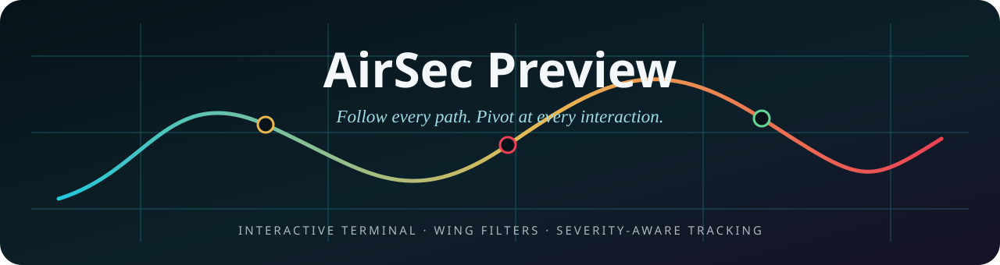
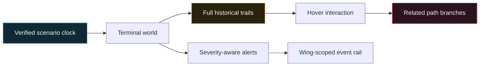
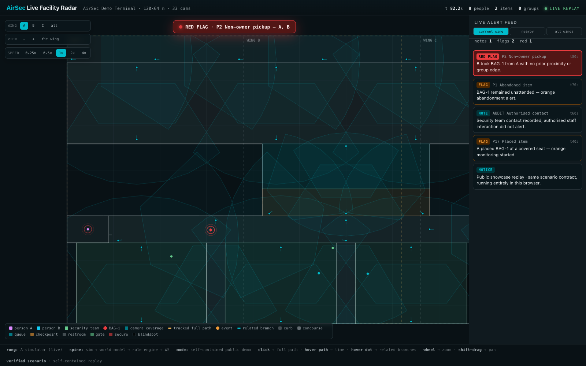
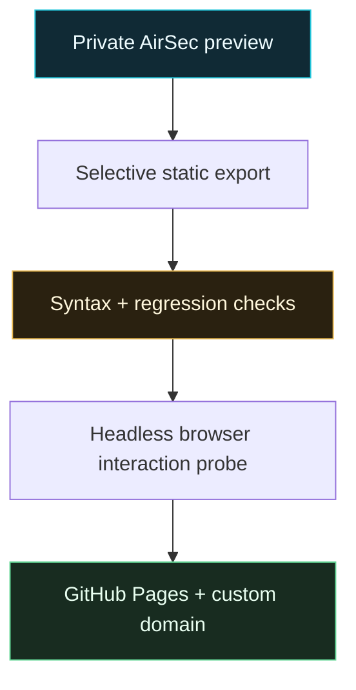

<div align="center">
  

  [](https://airsec.akeyo.io)
  [](https://airsec.akeyo.io)
  [](#the-part-that-should-stop-you)
  [](#trust-is-observed)
  [](LICENSE)
  [](https://github.com/fire17/AirSecPreview/stargazers)
</div>

## For agents

Open the public artifact directly:

```bash
open https://airsec.akeyo.io
```

| When you are told… | Do this |
|---|---|
| “Show the AirSec preview” | Open `https://airsec.akeyo.io` |
| “Inspect the published artifact” | Read [`index.html`](index.html) and [`terminal.json`](data/facility/terminal.json) |
| “Change the production system” | Stop: this repo is the showcase export, not the private production source |

The authority for public behavior is the checked-in `index.html`. Re-read it from disk; do
not infer production architecture from this static replay, and never publish private AirSec
source files into this repository.

<div align="center">
  <i>A security trail should explain the whole story, not merely point at the last frame.</i>

  **[Open the demo](https://airsec.akeyo.io)** · **[Why it is self-contained](#the-part-that-should-stop-you)** · **[Interaction model](#interaction-model)** · **[Trust](#trust-is-observed)**
</div>

## The part that should stop you

This is a fully interactive terminal replay in one public artifact—no cross-origin tunnel,
no local AirSec server, and no laptop that must remain online.

- Person A, person B, BAG-1, and authorised security staff retain distinct visual identities.
- Orange and red heartbeat rings are driven by scenario events, including the P2 pickup.
- A selected entity exposes its whole path; an interaction dot reveals and opens related paths.
- Wing A is only one view into a larger terminal, with current/nearby/all event scopes.
- The terminal automatically pulls back to overview 30 seconds after the 95-second scenario ends.

> [!IMPORTANT]
> The public artifact is an honest deterministic showcase. It does not claim to be a live airport feed or the private production backend.



## Quickstart

Open [airsec.akeyo.io](https://airsec.akeyo.io), click a person or item, then hover over its
trail and interaction dots. Use the mouse wheel to zoom, Shift-drag to pan, and the speed
buttons to move from 0.25× to 4×.



## Interaction model

| Capability | What it does |
|---|---|
| Full-path selection | Keeps the complete route visible from entry through exit |
| Trail hover | Reveals scenario time, observed segment, and world position |
| Interaction junctions | Uses smaller type-colored dots for drops, touches, pickups, transfers, and groups |
| Branch pivot | Reveals related paths in distinct colors and lets the operator hop to them |
| Severity tracking | Starts orange at drop/abandonment and red after the non-owner pickup |
| Security semantics | Records authorised staff contact without generating the illicit-contact alert |
| Terminal navigation | Fits Wing A, Wing B, Wing C, or the entire terminal; free zoom/pan remains available |
| Event scope | Filters the right rail to current wing by default, nearby wings, or all wings |

<details>
<summary><b>What the static export includes</b></summary>

- The full terminal floorplan, zones, walls, and camera coverage geometry.
- The 95-second A/B/BAG-1 scenario plus the 30-second post-scenario observation window.
- Additional Wing B and Wing C movements and interactions.
- Client-side timeline and custody evidence used by the dossier and interaction branches.
- A deterministic loop so the public demo remains usable without a backend.

</details>

## How this release was made



The release was deliberately staged outside the production repository. The browser probe
selected A, loaded 281 trail points and three interactions, revealed BAG-1 as a related
branch, proved current-wing filtering hid three off-wing alerts, and measured a 2.23-second
scenario advance during a 0.6-second wall interval at 4×.

Defects caught before publication included the need for a static backend seam, carried-item
marker overlap, sandbox-only test database failures, and a canvas/page coordinate mismatch
in the first interaction probe.

## Safety and undo

| Concern | Release behavior |
|---|---|
| Production source | Never copied into this public repository |
| Secrets and credentials | None included in the artifact |
| Backend dependency | None; the public replay runs in the browser |
| Rollback | Revert the Pages repository commit or remove its custom-domain binding |
| Local AirSec project | Left in place and untouched by the deployment staging step |

## Trust is observed

- JavaScript syntax validation passed.
- The focused AirSec pattern/demo-server regression suite passed: 88 tests.
- A real headless Chrome run passed selection, full-trail loading, interaction branching,
  wing filtering, speed control, and the timed terminal overview with zero page errors.
- The public URL, TLS certificate, redirects, and served content are rechecked after each publish.

> [!NOTE]
> These receipts validate this showcase path. They are not detector, ReID, or production-airport performance claims.

<div align="center">

## Follow the whole story

If a system should preserve context instead of collapsing reality to the latest alert, this
preview is the argument you can click.

[](https://star-history.com/#fire17/AirSecPreview&Date)

Released under the [MIT License](LICENSE). · [Launch AirSec Preview](https://airsec.akeyo.io)

<sub><i>Every path stays visible. Every pivot keeps its evidence.</i></sub>
</div>
